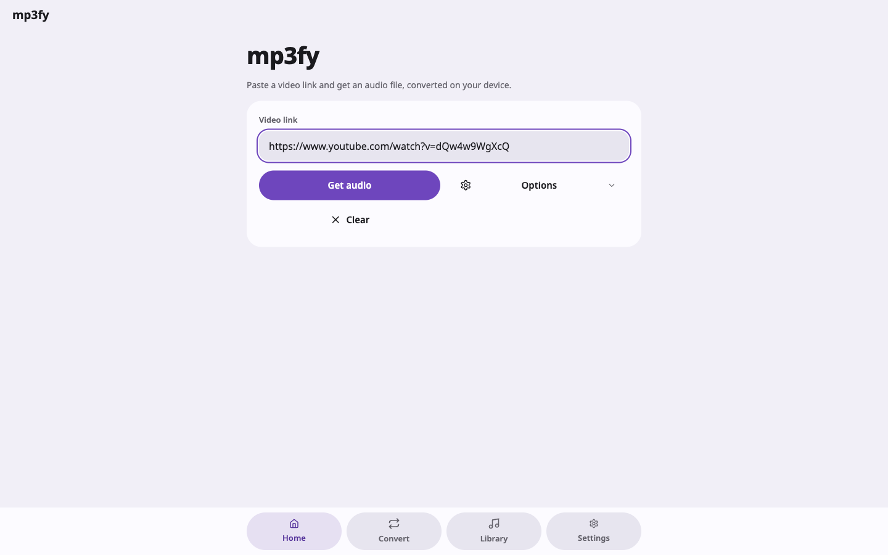

# mp3fy

Turn any video link into a local audio file. Paste a link, pick a format, get
an mp3 — or m4a, opus, flac, wav, or the video itself. Everything runs on your
own device, over your own connection: there is no server in the middle.

Desktop app for macOS, Windows and Linux, built with SvelteKit, Tauri 2 and
[MoreThanUI](https://morethancoder.com).



## Install

Grab the file for your platform from the
[latest release](https://github.com/morethancoder/mp3fy/releases/latest).

| Platform | File | Notes |
| --- | --- | --- |
| macOS (Apple Silicon + Intel) | `mp3fy_<version>_universal.dmg` | Drag to Applications |
| Windows 10/11 | `mp3fy_<version>_x64-setup.exe` or `_x64_en-US.msi` | Either installer works |
| Linux (Debian/Ubuntu) | `mp3fy_<version>_amd64.deb` | `sudo apt install ./mp3fy_*.deb` |
| Linux (any distro) | `mp3fy_<version>_amd64.AppImage` | `chmod +x` then run |
| Linux (Fedora/RHEL) | `mp3fy-<version>-1.x86_64.rpm` | `sudo dnf install ./mp3fy-*.rpm` |

The bundles are **not code-signed** — signing needs paid Apple and Windows
certificates — so both systems will warn you the first time:

- **macOS**: "mp3fy is damaged" or "unidentified developer" → open Terminal and
  run `xattr -dr com.apple.quarantine /Applications/mp3fy.app`, then launch it
  normally. (Or right-click the app → Open → Open.)
- **Windows**: SmartScreen shows "Windows protected your PC" → *More info* →
  *Run anyway*.
- **Linux (AppImage)**: builds on Ubuntu 24.04, so it needs glibc 2.39 or
  newer. On older distros use the `.deb`/`.rpm`, or build from source.

### What it downloads on first run

mp3fy fetches [yt-dlp](https://github.com/yt-dlp/yt-dlp) (and ffmpeg, if your
system doesn't already have one) into its own app-data folder the first time
you use it, and keeps yt-dlp updated from then on. Nothing is installed
system-wide, and no download is proxied — yt-dlp runs locally, from your IP.

Finished files land in `Downloads/mp3fy`.

## Using it

- **Home** — paste or type a link, choose the format and quality under
  *Options*, press *Get audio*.
- **Convert** — turn a video or audio file already on your device into
  another format.
- **Library** — everything mp3fy has produced. Audio plays in place (with a
  full-screen player, playlists, shuffle and repeat); video hands off to your
  file manager.
- **Settings** — theme (light/dark/system), app language (English/العربية,
  with full RTL), default format and quality, yt-dlp version and updates, and
  the log viewer under *Developer*.

### Sharing a link into mp3fy

mp3fy registers the `mp3fy://` URL scheme. Open one and the app comes to the
front and *starts the download immediately* — no pasting, no extra click:

```
mp3fy://https://www.youtube.com/watch?v=VIDEO_ID
mp3fy://open?url=https%3A%2F%2Fyoutu.be%2FVIDEO_ID
```

Links shared while another download is running queue up behind it. See
[docs/sharing.md](docs/sharing.md) for what this looks like per platform and
how to wire it to a browser button or a share menu.

## Build from source

Needs Node 22+, pnpm and Rust (plus [Tauri's system
prerequisites](https://tauri.app/start/prerequisites/) on Linux). `make` with
no target lists everything.

```sh
make setup    # check tools, install dependencies
make dev      # run the desktop app with hot reload
make web      # run only the UI in a browser on :1420
make check    # type-check the frontend and the Rust backend
make build    # bundle the app for the current platform
make release  # tag a version and let CI build every platform
```

Releases are cut by pushing a `v*` tag: GitHub Actions builds macOS, Windows
and Linux bundles and attaches them to the release. See
[docs/releasing.md](docs/releasing.md).

## Privacy

No accounts, no telemetry, no server. The app talks to the site you gave it a
link to, to GitHub for yt-dlp updates, and to nothing else. History, playlists
and settings live in the app's own local storage; the audio lives in your
Downloads folder.

Downloading media you don't have the rights to may be against a site's terms
of service or your local law — that call is yours.

## License

[MIT](LICENSE). Powered by yt-dlp and ffmpeg, which carry their own licenses.
